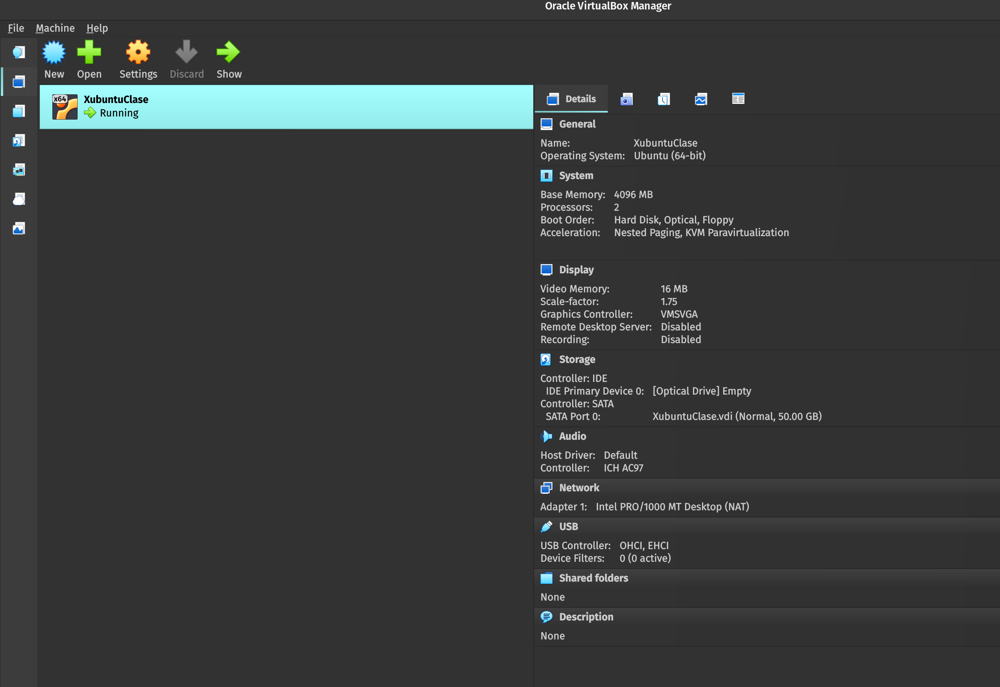
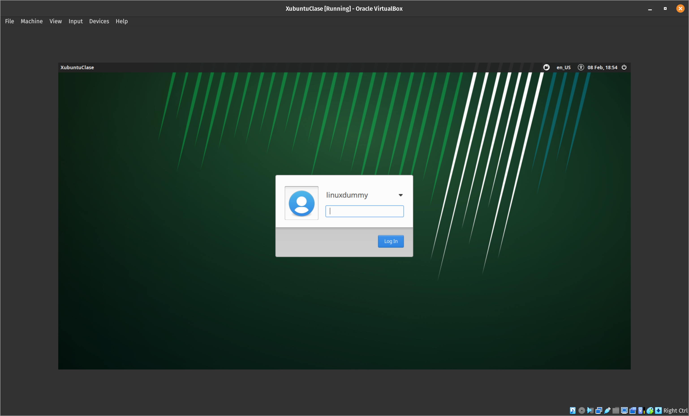
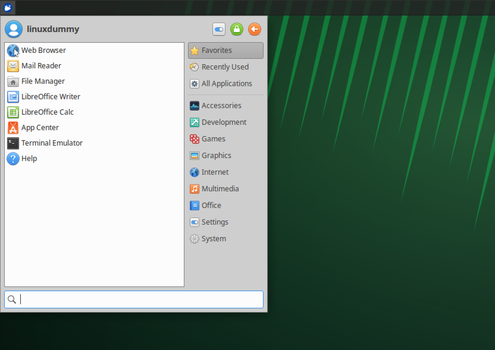
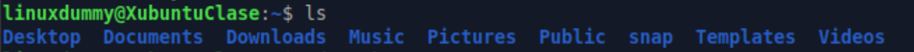
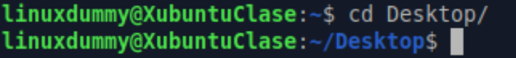
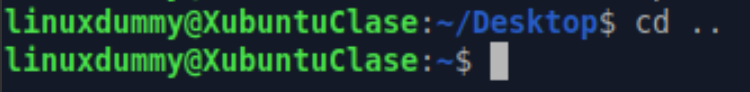
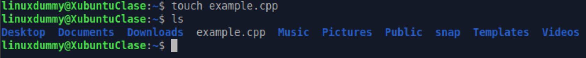
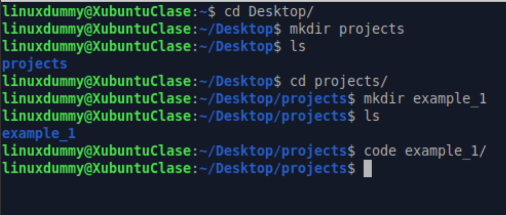
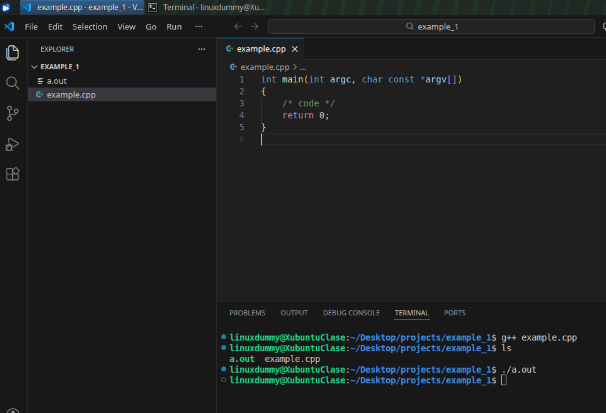

# Starting the Unix Journey

This will be a guide on how to use the basic tools in class and that will be:

- Using a xubuntu virtual machine
- Basic navigation through the terminal and the unix file system
- Basic commands for creating files and directories
- Compiling with g++ and gcc compiler for both basic C and C++ programs
- Basic git and github usage

## Using VMs

1. Download virtualbox and install it
2. Download the zip file from the class Drive
3. Unzip it in a directory inside windows that you can easily access
4. Double click on the file with the .vbox termination
5. Or open it via the virtual box software via de Open button and searching for the directory you saved the decompressed directory containing the virtual machine
    
6. If open correctly it should look like this:
    
7. Enter user: linuxdummy and password: linux
8. Also don't forget to enable the bidirectional clipboard, to copy paste and back from your main OS and your VM and adjust screen size to be more comfortable.
    1. For the clipboard nable it by going to the VM taskbar go through Devices > Shared Clipboard > Bidirectional.
    2. For the screen go to View > Virtual screen and play with the scale percent and the scale resolution for a better view
## Basic navigation through Linux

1. First open your terminal, click in the blue button so a the start tab can appear, click on the terminal emulator app to well open the terminal



2. Once open it will give you a prompt like this ``linuxdummy@XubuntuClase:~$``
    - Our prompt has different parts:
        1. `linuxdummy` is the name of our user
        2. `XubuntuClase` is the name of the computer
        3. The `:` is a separator
        4. The `~` represents the current directory that we are in
        4. The `$` is the level of privilege of the user

3. Now we have a way to know what it is inside our computer, how to move between directories and how to create files, for this we use commands, the commands are written in the prompt and executed by hitting enter.
    1. Our first command will be `pwd`this will tell us where we are in the file system of our computer

    

    2. After that we have to see what does our current directory has for this we use the `ls` command
        - This command will list everything our current directory has in, so be it files or other directories/folder this will be listed in different colors, usually a solid color for directories/folders and plain white for files.
    
    

    3. Now let us move our position to the Desktop directory/folder, once we use the command like `cd Desktop`we shall see that our prompt changed, to show that we moved our position from the `~` position to the `~/Desktop` position

    

    4. Now what if we want to return to the previous position, for this we use cd again but like this `cd ..` the .. usually means the level above mine in the hierarchy of directories/folders in short is move me back to my parent folder

    

4. Now that we know how to move in our filesystem, let us create and modify a C++ script with our terminal.
    1. To create a file use the command `touch file_you_want_to_create` to create a c++ program we will use it like this `touch example.cpp`, if the command succesfully creates a file it will just give us the prompt again, to make sure we created the file use `ls` we will see in plain white text the name of our file

    

    2. To modify it we have to use a text editor like vscode, I have it preinstalled in the vm and we can use it via a command called `code` to open the file we just have to enter the `code example.cpp`to start editing.

5. Now we know how to create files, this will be a useful tool, but what if we want to order our work in directories?
    1. First let us move to our Desktop directory from the terminal `cd Desktop`.
    2. Then to create a directory use the `mkdir` command, let us create a projects folder inside desktop `mkdir projects` remember to use `ls` to check that it was created.
    3. Then let us move to the newly projects folder and create another folder called example_1 with `mkdir example_1`
    4. Instead of navigating to this example_1 folder we want to use it to save and have order in our vscode project, for this we have to use the `code` command with the name of the folder as argument like this `code example_1` and it will open the folder.

    

6. Now that we know that we have to compile our projects using the gnu compilers for c `gcc` and c++ `c++`
    1. Let us use the example_1 folder and vscode we opened for this, we create a new file with visualstudio code called example.cpp
    2. Once we created just insert a basic c++ script, you can copy paste this one:

    ```C++
    int main() {
        return 0;
    }
    ```
    3. Then inside use the shortcut by hitting the keys ctrl+j to open the vscode terminal, now a terminal prompt will appear below your script.
    4. Click the terminal to be able to use it and to compile our basic script use the `g++ file_to_compile.cpp` command like this `g++ example.cpp`
    5. A a.out file shall appear on your files, you can check in the terminal by hitting ls or seeing it on the VScode ui.
    6. This a.out is an executable file, to execute it use the terminal, inside your vscode terminal you have to use the command `./` like this `./a.out` if no message appears and it lets you use your terminal you have succesfully compiled and executed your first program from the terminal.
    
    

