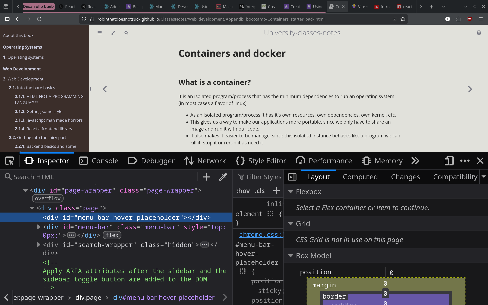
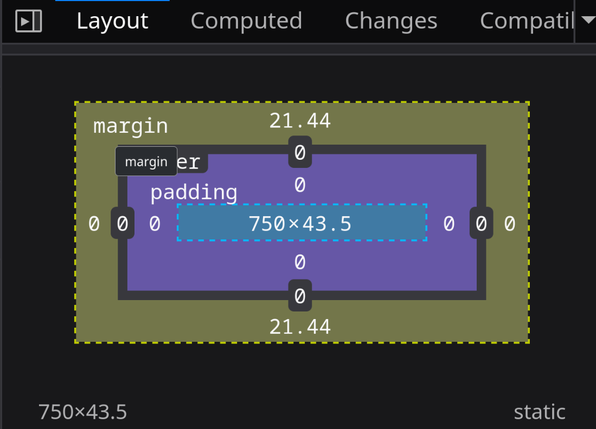

# Getting some style


CSS stands for Cascading Style Sheets:

- It let developers to add some needed style and color to the web
- It is a simple yet super powerful and complex tool
- The most complex topic in web page design is CSS so buckle up

## Basic CSS structure

Css needs something we call selector:

- A selector is the element you want to stlye
- Then we need a declaration with a property and the value we want to change from that property and it goes something like this

```css
body {
        background: plum;
        color: black;
    }
```

In this case we want to modify the body element and we want the background color to be plum color and that stand alone property called color modifies the text color of the element and we change that to black.

But CSS not only let's us select elements by type of element it can modify elements by class, ID and even handle inheritance in some weird css way and not only that it lets us group the styling so that we don't have to repeat code.

In the [repository of presentations for the class](https://github.com/Robinthatdoesnotsuck/ClassPresentations) under the second week branch you can observe different style selector for css in action.

## Selectors

Selectors are the way we specify what elements we want to style and they come in different in different flavors, mostly regarding the scope of the styling we want to apply

### Basic selectors

- By ID:
  - We can select them by refering to an ID like this
  
  ```css
  #some_id {
    font-family: Consolas,monaco,monospace;
  }
  ```

- By Class
  - We make the reference to a class with

  ```css
  .some_class {
    font-family: Consolas,monaco,monospace;
  }
  ```

- By Element
  - This will affect every element of that type

  ```css
  b {
    font-family: Consolas,monaco,monospace;
  }
  ```

## The hardest (in my opinion) part of css

Let us talk about positioning an element where want to on the page, like how do we do that?
Css lets us manage well everything regarding style on the html elements but the important thing is well, where in the layout will the element be?

Css has many tools for this or that try to help us with it (I say try cause positioning gets kinda funky).

The first thing we have to take into account is the cell area that an element occupies on the HTML layout, but how do we see that???

We can go to any page, in this example let us open the inspector on our browser with F12 it shoul look something like this



Here we can explore the source code of our page and we can use the  to hover over the element we want to inspect.

Once you hover over the element you will see something change in the layout sub-tab on the inspector, in that sub-tab we have some boxes that display data, the name of these boxes are Flexbox, Grid and the Box Model. What matters now is the Box Model so lets check it out and what does that weird boxes mean.

First we have a yellow box, that determines the margin of the element 
that is the distance or the space around other elements
